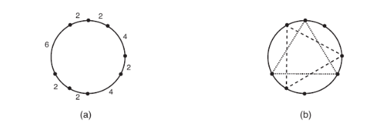

<p style="text-align: center;"><b>Taller 1</b></p>
<p style="text-align: center;"><b>Estructuras de datos</b></p>
<p style="text-align: center;"><b>Febrero 25, 2026</b></p>

**1.** Evaluar y comparar el rendimiento promedio de los algoritmos de ordenamiento vistos en clase para el caso de uso de ordenar las palabras de un libro de su elección, extrayendo sus propias conclusiones sobre los resultados obtenidos. (Se deben omitir todos los signos de puntuación y se sugiere que todas las palabras se encuentren en minúscula) Para realizar este proceso se deben cumplir los siguientes requerimientos: 

- Extraer las palabras presentes en el texto y almacenarlas en un arreglo 

- Evaluar el tiempo que toma ordenar las palabras de manera descendente para tres de los algoritmos de ordenamiento vistos en clase, libres a su elección. Estos algoritmos deben ser implementados en lenguaje C

- Repetir la evaluación de tiempo de ejecución para cada uno de los algoritmos (se recomienda hacerlo 20 veces con el propósito de obtener un tiempo promedio de ejecución; no se debe considerar el tiempo tomado para la extracción de las palabras y su almacenamiento en un arreglo) 

- Reportar los resultados obtenidos (es decir, los tiempos que tomó cada algoritmo en sus respectivas ejecuciones así como el tiempo promedio de ejecución) - Presentar las conclusiones a las que se llegaron tras realizar el proceso.

**2.** Considerando que las operaciones de eliminación de cabeza, cola, o en una posición dada a partir de la cabeza de un conjunto de nodos se implementa de la siguiente manera, respectivamente:

```C
Node* delete_head(struct Node *head){
    if (head == NULL) return NULL;
    struct Node *temp = head;
    head = temp->next;
    free(temp);
    return head;
}
```

```C
Node* delete_tail(struct Node *head){
    if (head == NULL) return NULL;
    if (head->next == NULL){
        free(head);
        return NULL;
    }
    struct Node *secondLast = head;
    while (secondLast->next->next != NULL) secondLast = secondLast->next;
    free(secondLast->next);
    secondLast->next = NULL;
    return head;
}
```

```C
Node* delete_at_position(Node* head, int position){
    if (head == NULL) return NULL;
    if (position == 0)
    {
        Node* temp = head;
        head = head->next;
        free(temp);
        return head;
    }
    Node* curr = head;
    for (int i = 0; i < position - 1 && curr->next != NULL; i++) curr = curr->next;
    if (curr->next == NULL) return head;
    Node* temp = curr->next;
    curr->next = temp->next;
    free(temp);
    return head;
}
```

Realizar la implementación correspondiente para una lista enlazada, según lo visto en clase. Debe consistir de funciones `void` que en lugar de recibir un `Node*`, reciban un puntero a una lista enlazada.

**3.** Recibe una entrada que contiene $N$ puntos en un círculo. Debe escribir un programa que determine cuántos triángulos equilateros diferentes pueden construirse a partir de los puntos dados como vértices.

La figura siguiente ilustra un ejemplo: (a) muestra un conjunto de puntos, determinados por las distancias de los arcos que tienen puntos adyacentes como extremos; y (b) muestra los dos triángulos que pueden ser construídos a partir de estos puntos.



### Entrada: 

La entrada contiene varios casos de prueba. La primera linea del caso de prueba contiene un entero $N$, el número de puntos dados. La segunda línea contiene N enteros $X_i$, representando las longitudes de los arcos entre dos puntos consecutivos del circulo, para todo $1 ≤ i ≤ (N − 1)$, $X_i$ representa la longitud del arco entre los puntos $i$ e $i+1$, $X_N$ representa la longitud del arco entre los puntos $N$ y $1$.

### Salida:

Para cada caso de prueba, el programa debe generar una sola línea de salida, conteniendo un único entero: El número de triángulos equilateros distintos que se pueden construir usando los puntos dados como vértices.

### Ejemplo de Entrada:

```plaintext
8
4 2 4 2 2 6 2 2
6
3 4 2 1 5 3
```

### Ejemplo de Salida:

```plaintext
2
1
```

**Restricción:** El tiempo de ejecución para cualquier caso de prueba no debe exceder 1.000 segundo.